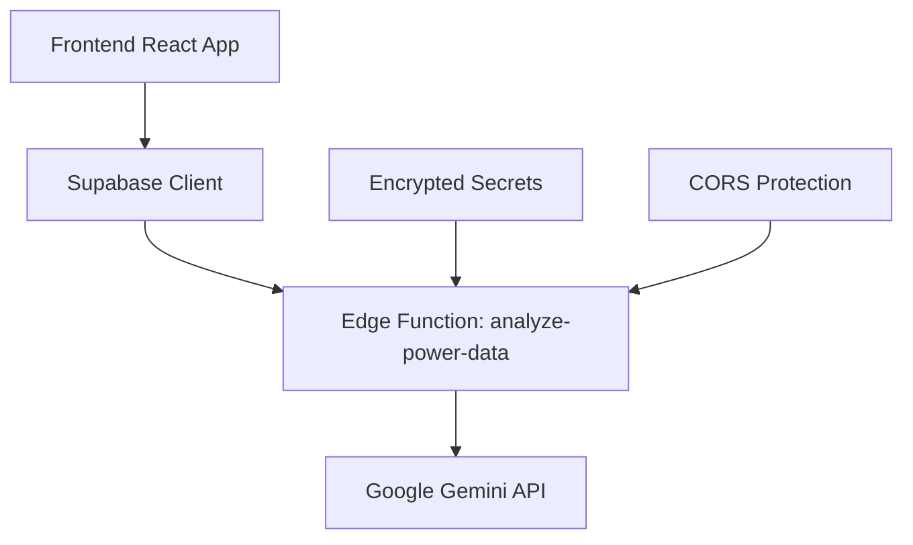

# AI Power Systems Analyzer

A sophisticated web application that leverages Google Gemini AI to analyze three-phase electrical power systems data. This tool is designed for electrical engineers, power system analysts, and researchers who need intelligent analysis of electrical measurements.

## 🔌 What It Does

The AI Power Systems Analyzer processes raw electrical measurements from three-phase power systems and provides:
- **RMS and Peak Value Calculations**: Accurate electrical parameter calculations
- **Power Analysis**: Active, reactive, and apparent power calculations with power factor
- **Phase Relationship Analysis**: Detailed phase angle measurements between voltages and currents
- **Frequency Analysis**: System frequency detection and analysis
- **Power Quality Assessment**: Detection of harmonics, imbalances, and disturbances
- **Fault Detection**: Identification of electrical faults and anomalies
- **Load Analysis**: Comprehensive load characterization

## 🏗️ Technical Architecture

### Frontend Stack
- **React 18** with TypeScript for type-safe development
- **Tailwind CSS** with custom design system for responsive UI
- **Vite** for fast development and optimized builds
- **Shadcn/ui** components for consistent interface elements

### Backend Infrastructure
- **Supabase Edge Functions** for serverless backend processing
- **Google Gemini 1.5 Pro** for AI-powered electrical analysis
- **Supabase Client** for secure API communication

### Security Architecture


## ⚡ How It Works

### 1. Data Input Format
The application accepts three-phase electrical data in JSON format:

```json
{
  "voltage_L1": [120.0, 118.5, 121.2, ...],
  "voltage_L2": [119.8, 121.0, 118.9, ...], 
  "voltage_L3": [120.2, 119.7, 120.8, ...],
  "current_L1": [15.2, 15.0, 15.4, ...],
  "current_L2": [14.8, 15.1, 14.9, ...],
  "current_L3": [15.0, 14.9, 15.2, ...],
  "sampling_rate_hz": 1000
}
```

### 2. Processing Pipeline

#### Step 1: Data Validation
- **Format Verification**: Ensures JSON structure matches required schema
- **Array Length Consistency**: Validates all measurement arrays have equal length
- **Numeric Validation**: Confirms all values are valid numbers
- **Sampling Rate Check**: Verifies sampling rate is specified and reasonable

#### Step 2: AI Analysis Selection
Four specialized analysis modes available:

**🌊 Waveform Analysis**
- Fundamental frequency extraction
- Harmonic content analysis
- Waveform symmetry assessment
- Peak and RMS calculations

**⚡ Power Quality**
- Total Harmonic Distortion (THD) calculation
- Voltage unbalance analysis
- Flicker and voltage variation detection
- Power factor assessment

**🚨 Fault Detection**
- Ground fault identification
- Phase loss detection
- Overcurrent condition analysis
- Abnormal phase relationships

**📊 Load Analysis**
- Load type classification (resistive, inductive, capacitive)
- Load balancing assessment
- Demand analysis
- Efficiency calculations

#### Step 3: Secure AI Processing
```typescript
// Data flows through secure edge function
const result = await supabase.functions.invoke('analyze-power-data', {
  body: { data: powerData, mode: selectedMode }
});
```

#### Step 4: Structured Output
The AI returns comprehensive analysis in structured format:

```json
{
  "rms_values": {
    "voltage_L1": 120.1,
    "voltage_L2": 119.9,
    "voltage_L3": 120.0,
    "current_L1": 15.1,
    "current_L2": 14.9,
    "current_L3": 15.0
  },
  "peak_values": {
    "voltage_L1": 169.8,
    "voltage_L2": 169.6,
    "voltage_L3": 169.7,
    "current_L1": 21.4,
    "current_L2": 21.1,
    "current_L3": 21.2
  },
  "frequency_hz": 60.02,
  "phase_angles_degrees": {
    "voltage_L1_vs_current_L1": 30.2,
    "voltage_L1_vs_voltage_L2": 120.1,
    "voltage_L2_vs_voltage_L3": 119.9,
    // ... additional phase relationships
  },
  "power_calculations": {
    "active_power_kw": 3.12,
    "reactive_power_kvar": 1.85,
    "apparent_power_kva": 3.63,
    "power_factor": 0.86
  },
  "analysis_summary": "Balanced three-phase system with slight inductive load..."
}
```

## 📊 Example Datasets Explained

### 1. Balanced Three-Phase System
**Purpose**: Baseline reference for perfect electrical conditions
**Characteristics**:
- Perfect 120° phase separation between L1, L2, L3
- Balanced 120V RMS voltages
- Equal 15A currents with 30° inductive lag
- Clean 60Hz sinusoidal waveforms
- Power factor: ~0.866 (typical for balanced inductive load)

**Use Case**: Verify analysis accuracy against known perfect conditions

### 2. Unbalanced System with Harmonics
**Purpose**: Real-world power quality analysis
**Characteristics**:
- Voltage imbalance: L1=122V, L2=118V, L3=120V
- 3rd harmonic content (20% amplitude)
- Unequal currents reflecting load imbalance
- 45° phase shift indicating different load types
- Higher THD requiring power quality assessment

**Use Case**: Test harmonic detection and power quality analysis capabilities

### 3. High Frequency Transient
**Purpose**: Switching transient detection
**Characteristics**:
- Normal 60Hz base frequency
- 1000Hz transient oscillation (first 0.1 seconds)
- Exponentially decaying amplitude
- Simulates capacitor switching or motor starting
- Tests transient detection algorithms

**Use Case**: Validate fault detection and transient analysis capabilities

## 🚀 Setup and Configuration

### Prerequisites
- Node.js 18+ and npm
- Supabase account
- Google AI Studio account for Gemini API key

### Environment Setup

1. **Clone and Install**
```bash
git clone <your-repo-url>
cd ai-power-analyzer
npm install
```

2. **Supabase Configuration**
The project is pre-configured with Supabase. The edge function will be deployed automatically.

3. **Gemini API Key Setup**
- Get your API key from [Google AI Studio](https://makersuite.google.com/app/apikey)
- The application will prompt you to add the `GEMINI_API_KEY` when needed
- Keys are stored securely in Supabase secrets

4. **Development**
```bash
npm run dev
```

## 🔌 API Documentation

### Edge Function: analyze-power-data

**Endpoint**: `https://wsvhijcrqgmdrtfzhugu.supabase.co/functions/v1/analyze-power-data`

**Method**: POST

**Request Body**:
```typescript
{
  data: {
    voltage_L1: number[];
    voltage_L2: number[];
    voltage_L3: number[];
    current_L1: number[];
    current_L2: number[];
    current_L3: number[];
    sampling_rate_hz: number;
  },
  mode: "waveform" | "power_quality" | "fault_detection" | "load_analysis"
}
```

**Response**: Structured electrical analysis (see "How It Works" section)

**Error Handling**:
- 400: Invalid input data format
- 500: AI processing error or API failure
- 401: Authentication required (if JWT verification enabled)

## ⚙️ Electrical Engineering Context

### Calculations Performed

**RMS (Root Mean Square) Values**:
```
RMS = √(1/n × Σ(x²))
```
Critical for determining effective voltage and current values.

**Power Calculations**:
```
Active Power (P) = V × I × cos(φ)
Reactive Power (Q) = V × I × sin(φ)
Apparent Power (S) = V × I
Power Factor = P/S = cos(φ)
```

**Phase Angle Analysis**:
Uses FFT and cross-correlation to determine phase relationships between signals.

**Harmonic Analysis**:
Applies Fast Fourier Transform (FFT) to identify harmonic content and calculate Total Harmonic Distortion (THD).

### Industry Standards
- **IEEE 519**: Harmonic analysis standards
- **IEEE 1159**: Power quality measurement guidelines
- **IEC 61000**: Electromagnetic compatibility standards

### Common Use Cases
1. **Power Quality Audits**: Identify harmonic distortion and voltage issues
2. **Load Studies**: Analyze facility electrical demands
3. **Fault Investigation**: Determine causes of electrical failures
4. **Equipment Testing**: Validate electrical equipment performance
5. **Energy Efficiency**: Optimize power factor and reduce losses

## 🔒 Security and Production

### Security Measures
- **API Key Protection**: Gemini API key stored as encrypted Supabase secret
- **CORS Protection**: Configured for web application access
- **Input Validation**: Comprehensive data validation before processing
- **Error Sanitization**: No sensitive data exposed in error messages

### Production Considerations
- **Rate Limiting**: Implement API rate limiting for production use
- **Monitoring**: Set up Supabase function monitoring and alerting
- **Backup**: Regular backup of analysis configurations
- **Scaling**: Edge functions auto-scale based on demand

### Monitoring and Logging
- Edge function logs available in Supabase dashboard
- Comprehensive error logging for debugging
- Performance metrics tracking

## 🔧 Troubleshooting

### Common Issues

**"Analysis failed: Edge function returned a non-2xx status code"**
- Check Gemini API key is properly configured
- Verify input data format matches required schema
- Check edge function logs for detailed error information

**"No result received from analysis service"**
- Ensure stable internet connection
- Verify Supabase project is active
- Check if Gemini API has rate limits or quotas

**Invalid JSON Data**
- Use the data validator to check input format
- Ensure all arrays have equal length
- Verify sampling rate is a positive number

### Debug Resources
- [Edge Function Logs](https://supabase.com/dashboard/project/wsvhijcrqgmdrtfzhugu/functions/analyze-power-data/logs)
- [Supabase Functions Dashboard](https://supabase.com/dashboard/project/wsvhijcrqgmdrtfzhugu/functions)

## 📈 Future Enhancements

- **Real-time Data Streaming**: WebSocket support for live measurements
- **Historical Analysis**: Database storage for trend analysis
- **Report Generation**: PDF export of analysis results
- **Custom Models**: Training specialized models for specific equipment
- **Multi-language Support**: Analysis in multiple languages

## 🤝 Contributing

This project is built with Lovable.dev. To contribute:
1. Open the [Lovable Project](https://lovable.dev/projects/44876125-368c-4122-8a7b-02dcadf4a55b)
2. Make changes using the Lovable interface
3. Changes are automatically committed to this repository

## 📄 License

This project is built using Lovable.dev platform. Please refer to Lovable's terms of service for usage guidelines.

---

**Built with ❤️ using [Lovable.dev](https://lovable.dev) - The fastest way to build web applications with AI**